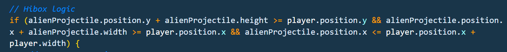
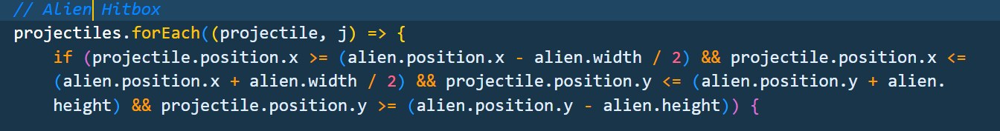
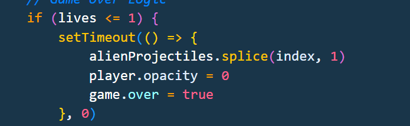
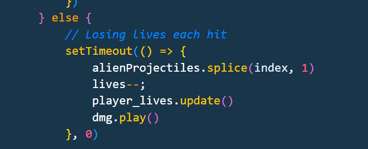
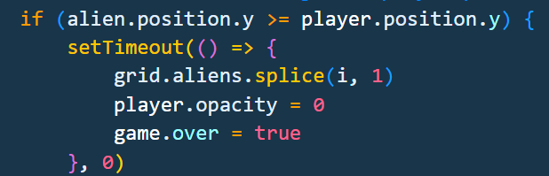
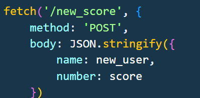
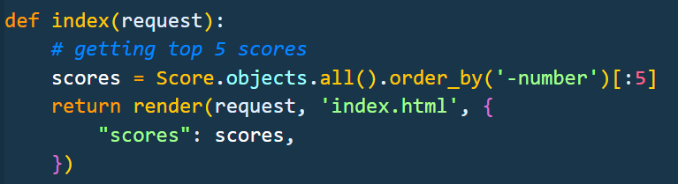
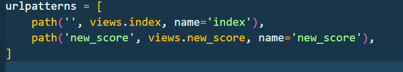
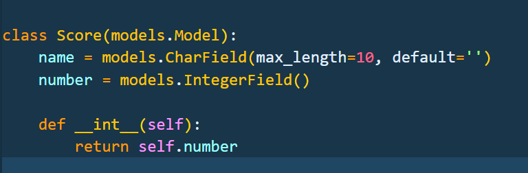

# Alien Invasion
#### Video Demo: [URL](https://youtu.be/ibut5fOm4ao)
## Technologies used:
* Python (Django)
* Javascript
* HTML
* CSS
* Bootstrap
## Instalation
* pip install django
* python manage.py runserver

## Description:
* My final project is a web-based game created in HTML5 canvas and Javascript. I've used Django web framework based in Python for keeping the score of the player. I've also used Bootstrap and Css for styling purposes.
Alien Invasion is my version of the popular Space Invader game. Space Invaders is a Japanese shooting video game released in 1978 by Taito. It is a never-ending game, that becomes progressively harder over time.
#### Javascript
* Alien Invasion uses 7 javascript classes(Player, Lives, Projectile, Particle, AlienProjectile, Alien, Grid) that are drew during animation loop.
* For a background I am using Particle class that are randomly spawn on canvas and are moving with +y trajectory that create an illusion that the player is moving forward. Background particles are white and light blue to imitate stars
* Innit function set the game state to active, reset the score and initialize all the variable to run the game.
* Create_particles function is creating particles after either player or aliens get hit. Particles disappear after a small amount of time
* laser_shot function creates a new Particle from the middle of a player sprite that moves with -y trajectory (up)
* animate keeps drawing and updating all the classes in Canvas. Also, it keeps checking for hitbox, lives, cleaning up arrays, and loss condition.
* Player hitbox logic

* Alien hitbox

* Lose condition
** Players are granted 5 lives at the start of the game and each time they get hit they lose one of the lives.

** If aliens reach the player Y position the game is lost instantly even if the player has some spare lives.

* To post the score into the database I am using fetch API POST method. More about that in Django section.

#### Player Controls
For left and right use Arrowkeys and for shooting projectiles use Space
* When moving left or right there is an animation change to the player sprite tilting the spaceship lightly toward the moving direction.

#### Sound
There are 4 different sounds losing_lives, laser_sound, hit_sound, and game_over_sound.
Sound samples were made using BFXR software(link is provided in the credits).

#### Python/Django
* In Django I am returning scores table with only the top 5 scores showing up in the HTML template.

* new_score is getting data from the Javascript and returning JSON response in the console if the score was successfully saved.
** Score can't be 0 or less.
* URLS

#### CSS/Bootstrap
* HTML content is fixed on top of the canvas using position and z-index.
* The game is in black/white/green colors to keep the space theme.
* There is animation around the score paragraph.

#### Database
For the database, I am using Models from Django. Class Score keeps information for username and score amount.

## Credits
* The illustrations for the game were taken from [PNG EGG](https://www.pngegg.com/)
* Sound was made using [BFXR](https://www.bfxr.net/)